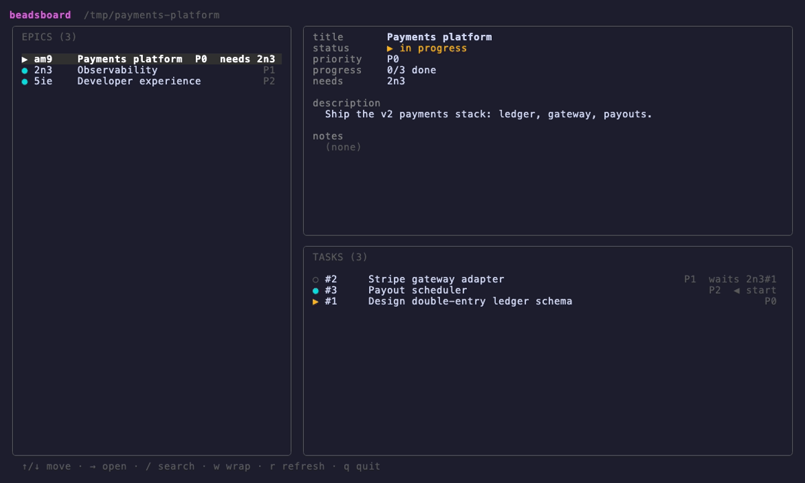

# beadsboard

A terminal UI for browsing and driving [beads](https://github.com/gastownhall/beads)
(`bd`) epics and tasks — a live master–detail board with inline editing, fuzzy
search, headless agents, and two-way GitHub sync.



```
beadsboard [--source DIR]   # DIR defaults to the current directory; must contain a .beads/
beadsboard --version
```

## What it does

- **Master–detail board.** Left: epics ordered by priority then build order (a topo
  sort of the inter-epic dependency graph). Right: the selected epic's fields over its
  task list, each annotated with status and what it `needs` / `waits` on. The detail
  tracks the cursor live.
- **Focus & drill in.** `enter` focuses the right pane; `tab` cycles its sections
  (title → status → priority → description → notes → tasks); `enter` on the task list
  opens a task's own detail page with the same motion. `esc` steps back out.
- **Inline editing** with `e` — title in a text box, status/priority by cycling with
  `←/→`, description/notes in a multiline editor. Saved straight through `bd update`;
  no `$EDITOR` handoff.
- **Fuzzy search** with `/`, scoped to whichever list is in view (epics or an epic's
  tasks). **`w`** wraps long epic titles.
- **Headless agents.** `a` spawns an autonomous `claude` in an isolated git worktree
  to work the task or epic and open a PR. The **Agents** tab shows each agent's live
  status; an agent that gets stuck stops and asks. `enter` resumes one in a floating
  zellij pane to intervene; `k` kills, `x` dismisses. `S` opens settings.
- **Live refresh.** A one-second fingerprint of `.beads/` reloads the board on any
  external `bd` write — never on the app's own reads.

## GitHub sync (optional plugin)

Enable `github_sync` in the config and beadsboard keeps bd, GitHub issues, and a
Projects board in step:

- Any bead change beadsboard picks up — a TUI edit or a `bd` write on the CLI — is
  pushed to its issue on the next reload; spawning an agent first ensures a tracking
  issue exists and asks the agent's PR to `Closes #N`.
- The bd epic→task hierarchy is mirrored as native GitHub **sub-issues**.
- A bundled workflow (`.github/workflows/beads-project-status.yml`) reflects each
  issue's status onto the Projects board's Status column.
- **`G`** pulls the other way — reads the board (or issue state + `status::` labels)
  and reconciles bead status, so a teammate moving a card flows back into bd.

## Use cases

**Single repo (the default).** Beads live in the repo you're working on
(`beadsboard --source .`), `github_sync` targets that one repo, and agents worktree
it. Status flows bd ↔ issues ↔ one board; a task's issue and the agent's PR are in
the same repo so `Closes #N` auto-closes. Nothing extra to configure beyond the
`github_*` keys below.

**Meta-repo.** A root repo holds only the beads (`.beads/`) and planning; the actual
projects are independent git repos underneath (`web/`, `api/`, …). Point beadsboard
at the root (`--source <root>`) and tag each epic with a `repo::<name>` label (the
value is the subdir name; tasks inherit it). Then:

- an agent for that bead worktrees `<root>/<name>` and runs there, with its `bd`
  pointed back at the root beads (`bd -C <root>`);
- the bead's issue is created in that sub-repo's GitHub repo (derived from its
  `origin` remote), so the agent's PR and the issue are co-located and `Closes #N`
  works;
- one Projects board aggregates issues across all the sub-repos, and `G` reconciles
  board/issue status back into the root beads (matched by issue URL, since numbers
  collide across repos).

Beads with no `repo::` label fall back to single-repo behavior, so the two modes
coexist. Setup — sub-repo remotes, the board, and deploying the status workflow per
sub-repo — is in [docs/meta-repo.md](docs/meta-repo.md).

## Install

```bash
go install github.com/pavlabs/beadsboard@latest
```

Or grab a prebuilt binary (darwin/linux, amd64/arm64) from the
[releases](https://github.com/pavlabs/beadsboard/releases). Releases are cut by
tagging `vX.Y.Z`, which runs the GoReleaser workflow.

## Config

Settings live in `~/.beadsboard/config.toml`, overridden per-repo by a local
`./.beadsboard/config.toml`. Edits apply live (the file is re-read on change), and
the in-app settings panel (`S`) writes the same file. Keys: `max_agents`, `max_turns`,
`permission_mode`, `recent_ttl_secs`, a `[tools]` allow-map, and the `github_sync` /
`github_repository` / `github_project_*` sync options.

## Development

```bash
go test ./...
go build -o beadsboard .
```

Stack: bubbletea + lipgloss + bubbles. `internal/beads` is the `bd` client and graph
derivation, `internal/agent` runs the worktree-isolated headless agents, and
`internal/ui` is the bubbletea model and rendering.
