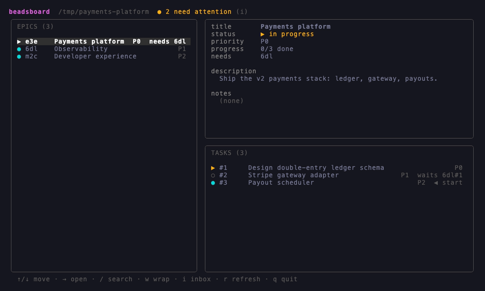

# beadsboard

A terminal UI for browsing and driving [beads](https://github.com/gastownhall/beads)
(`bd`) epics and tasks — a live master–detail board with inline editing, fuzzy
search, headless agents, an attention inbox, and two-way GitHub sync.



```
beadsboard [--source DIR]   # DIR defaults to the current directory; must contain a .beads/
beadsboard --version
```

## What it does

- **Master–detail board.** Left: epics ordered by priority then build order (a topo
  sort of the inter-epic dependency graph). Right: the selected epic's fields over its
  task list, each annotated with status and what it `needs` / `waits` on. The detail
  tracks the cursor live.
- **Focus & drill in.** `enter` focuses the right pane; `tab` cycles its sections
  (title → status → priority → description → notes → tasks); `enter` on the task list
  opens a task's own detail page with the same motion. `esc` steps back out.
- **Inline editing** with `e` — title in a text box, status/priority by cycling with
  `←/→`, description/notes in a multiline editor. Saved straight through `bd update`;
  no `$EDITOR` handoff.
- **Fuzzy search** with `/`, scoped to whichever list is in view (epics or an epic's
  tasks). Matches titles, full IDs, and short IDs such as `zjh.1` or `#1`;
  exact ID matches rank first. **`w`** wraps long epic titles.
- **Task filters.** With the epic's task list focused (`t`), `A` shows all tasks,
  `C` closed tasks, and `O` unfinished tasks with in-progress work first. The
  filter applies across epics for the current session and composes with search.
  Epic totals and `D` dispatch continue to use the complete task set.
- **Fullscreen task details.** `f` expands the selected task across the terminal.
  `f` or `Esc` restores the previous list or detail view. Editing and scrolling
  work in fullscreen; narrow task panes omit the side preview.
- **Live dashboard.** `v` opens a board-wide dashboard with task completion,
  in-progress, ready and blocked counts, plus percentages per priority. Each row
  uses that priority's total tasks; ready is a subset of open (unfinished) work.
  Epics are counted separately. `v` or `Esc` returns to the previous view.
- **Account limits.** The dashboard and task status bar show Claude and Codex
  subscription usage and reset times from your existing CLI logins. Checks run
  once a minute while either surface is visible, without starting a model turn.
  Failed checks retain the last sample marked `STALE` and retry after five minutes.
  The actual provider windows are shown (usually 5 hours and 7 days), not invented
  daily limits; missing windows and reset times are not treated as zero usage.
- **Agent launcher.** `a` opens a backend matrix: Claude and Codex can run autonomous
  coding agents in isolated git worktrees or planning sessions; Ollama supports
  planning sessions only because its plain CLI has no tool loop. The **Agents** tab shows each agent's live
  status; an agent that gets stuck stops and asks. `enter` resumes one in a floating
  zellij pane to intervene; `k` kills, `x` dismisses. `D` auto-runs the selected
  epic's open tasks in dependency order, filling available agent slots and queuing
  blocked tasks until their prerequisites close. `S` opens settings.
- **Attention inbox.** `i` answers one question board-wide: what is waiting on you?
  Agents that stopped to ask, agents that errored, registered agents whose process
  died mid-task, blocked beads, and open pull requests that need a human — one list,
  most urgent first. `enter` jumps the board to the bead; `o` opens the PR. A badge in
  the header counts them so nothing off-screen goes unnoticed.
  Task jumps open the detail page, including orphaned tasks; filters hiding the
  destination are cleared as needed. An unlinked PR stays in the inbox for `o`.
- **Pull requests across repos.** One GitHub search covers every sub-repo the board
  actually tracks and folds the results into the same inbox, each labelled with why it wants
  you — changes requested, checks red, conflicted, waiting on review, approved and
  unmerged, or simply stale. PRs are matched back to their bead by the issue they close
  (by URL, since numbers collide across repos), falling back to the agent's branch name.
- **Live refresh.** The board polls the revision of its own `bd export` and reloads when
  the issue data actually moves. It watches the data rather than `.beads/` file state,
  because `bd` rewrites Dolt's journal even on reads — file watching cannot tell the
  board's own reads from somebody else's edit.

## GitHub sync (optional plugin)

Enable `github_sync` in the config and beadsboard keeps bd, GitHub issues, and a
Projects board in step:

- Any bead change beadsboard picks up — a TUI edit or a `bd` write on the CLI — is
  pushed to its issue on the next reload; spawning an agent first ensures a tracking
  issue exists and asks the agent's PR to `Closes #N`.
- The bd epic→task hierarchy is mirrored as native GitHub **sub-issues**.
- A bundled workflow (`.github/workflows/beads-project-status.yml`) reflects each
  issue's status onto the Projects board's Status column.
- **`G`** pulls the other way — reads the board (or issue state + `status::` labels)
  and reconciles bead status, so a teammate moving a card flows back into bd.
- Open pull requests feed the attention inbox, scoped to the repos the board's own
  beads resolve to — the sub-repos behind their `repo::` labels, or
  `github_repository` in a single-repo project — so an unrelated repo in the same org
  never shows up. Refreshed on their own slower clock than the board, since GitHub is
  rate limited and PRs move far less often than local beads.

## Agents on a task

A task's detail page lists every agent working that bead — beadsboard's own
headless agents plus *external* ones — with a liveness dot and each agent's tool,
mode, and source. Records live in `.beadsboard/agents/` (one JSON per agent).

To surface an **external** Claude Code session (one you launched yourself) on its
bead, check out a `bead/<id>` branch and wire `hooks/session-agent.sh` for
`SessionStart`/`SessionEnd` in your `.claude/settings.json`:

```json
{
  "hooks": {
    "SessionStart": [{ "hooks": [{ "type": "command", "command": "/abs/path/to/beadsboard/hooks/session-agent.sh" }] }],
    "SessionEnd":   [{ "hooks": [{ "type": "command", "command": "/abs/path/to/beadsboard/hooks/session-agent.sh" }] }]
  }
}
```

The session registers against the bead named by its `bead/<id>` branch; sessions
on any other branch are ignored, and beadsboard-launched agents register
themselves. (`bd` and `jq` must be on `PATH`.)

## Use cases

**Single repo (the default).** Beads live in the repo you're working on
(`beadsboard --source .`), `github_sync` targets that one repo, and agents worktree
it. Status flows bd ↔ issues ↔ one board; a task's issue and the agent's PR are in
the same repo so `Closes #N` auto-closes. Nothing extra to configure beyond the
`github_*` keys below.

**Meta-repo.** A root repo holds only the beads (`.beads/`) and planning; the actual
projects are independent git repos underneath (`web/`, `api/`, …). Point beadsboard
at the root (`--source <root>`) and tag each epic with a `repo::<name>` label (the
value is the subdir name; tasks inherit it). Then:

- an agent for that bead worktrees `<root>/<name>` and runs there, with its `bd`
  pointed back at the root beads (`bd -C <root>`);
- the bead's issue is created in that sub-repo's GitHub repo (derived from its
  `origin` remote), so the agent's PR and the issue are co-located and `Closes #N`
  works;
- one Projects board aggregates issues across all the sub-repos, and `G` reconciles
  board/issue status back into the root beads (matched by issue URL, since numbers
  collide across repos).

Beads with no `repo::` label fall back to single-repo behavior, so the two modes
coexist. Setup — sub-repo remotes, the board, and deploying the status workflow per
sub-repo — is in [docs/meta-repo.md](docs/meta-repo.md).

## Install

```bash
go install github.com/pavlabs/beadsboard@latest
```

Or grab a prebuilt binary (darwin/linux, amd64/arm64) from the
[releases](https://github.com/pavlabs/beadsboard/releases). Releases are cut by
tagging `vX.Y.Z`, which runs the GoReleaser workflow.

## Config

Settings live in `~/.beadsboard/config.toml`, overridden per-repo by a local
`./.beadsboard/config.toml`. Edits apply live (the file is re-read on change), and
the in-app settings panel (`S`) writes the same file. Keys: `max_agents`, `max_turns`,
`permission_mode`, `recent_ttl_secs`, a `[tools]` allow-map, and the `github_sync` /
`github_repository` / `github_project_*` sync options.

Ollama planning uses `ollama run` with `qwen3:8b` by default. Set `OLLAMA_MODEL`
to any locally installed model name to override it. Ollama is intentionally not
offered for coding: the plain CLI cannot edit files, run checks, or open a PR.

## First-run setup

Run `beadsboard init --source PATH`. Before changing the directory, the command
identifies it as empty or existing-but-unplanned and asks for confirmation. The
wizard initializes Git and Beads, explains and records a `single` or `meta`
repository layout, writes the local configuration, and opens a persistent Claude
project-manager interview in Zellij. The PM proposes a lean epic set and must wait
for explicit confirmation before creating beads; after it launches, beadsboard
opens the freshly planned board.

For automation, use `--yes --layout single|meta`, optionally with
`--github-repo owner/repo`; `--no-tui` skips only the final board. A single-repo
GitHub value enables sync. Meta repositories leave root sync disabled because
individual beads route to their labelled sub-repositories.

Single-repo setup also writes native Beads `github.repository`, `github.owner`
and `github.repo`, so later `bd github` commands use the same repository outside
the board. Credentials are never written to project configuration. The GitHub
repository is distinct from Beads' `--repo` storage-routing option; meta-repo
tasks continue to use `repo::` labels.

Account-limit diagnostics are available with `beadsboard usage` (JSON output).
Codex uses the [app-server account API](https://developers.openai.com/codex/app-server).
Claude uses the OAuth usage endpoint used by Claude Code, with
`CLAUDE_CODE_OAUTH_TOKEN`, its credentials file, or the standard macOS Keychain
entry. That endpoint is not a public API contract and may change. Custom
`CLAUDE_CONFIG_DIR` credentials files are supported; a custom macOS Keychain
namespace requires the token environment variable. No tokens are printed or
stored by Beadsboard. API-key-only accounts may not expose subscription quotas.

The local config stores `pm_session` and `pm_summary`. Every later Claude planning
launch resumes that PM session, runs `bd prime` for authoritative context, and
updates the compact summary through `beadsboard pm summarize` rather than editing
TOML directly. Plain Ollama and Codex planning sessions receive the same recovery
prompt but cannot resume the Claude session.

## Development

```bash
go test ./...
go build -o beadsboard .
```

Terminal regression checks (temporary Python environment):

```bash
uv run --with pyte python tests/pty_smoke.py ./beadsboard
uv run --with pyte python tests/pty_board.py ./beadsboard
```

Stack: bubbletea + lipgloss + bubbles. `internal/beads` is the `bd` client, graph
derivation and the GitHub/pull-request queries, `internal/agent` runs the
worktree-isolated headless agents, `internal/attention` decides what wants the user,
and `internal/ui` is the bubbletea model and rendering.

The demo GIF is reproducible: `docs/demo-fixture.sh` seeds a throwaway beads project
and `vhs docs/demo.tape` re-records `docs/demo.gif` from it.
